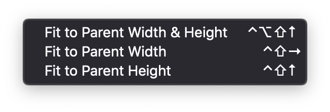

# Fit to Parent for Adobe XD
Resize objects to match the size of their parent group or artboard.

1. Search for and install "Fit to Parent" in Adobe XD plugins directory.
2. Set keyboard shortcuts.

